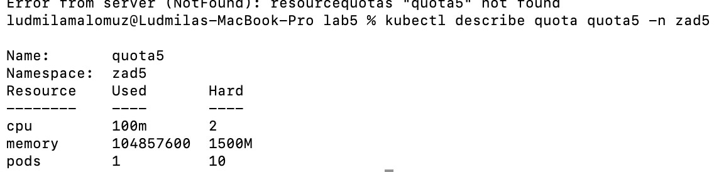
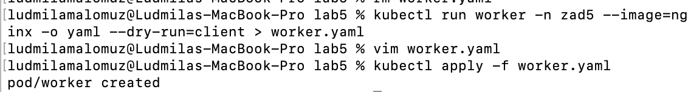
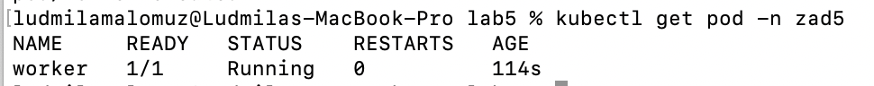
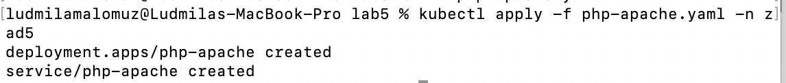
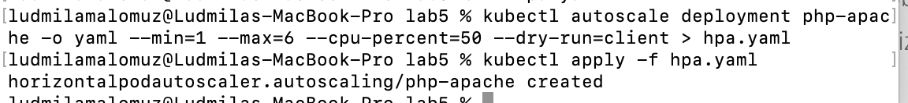
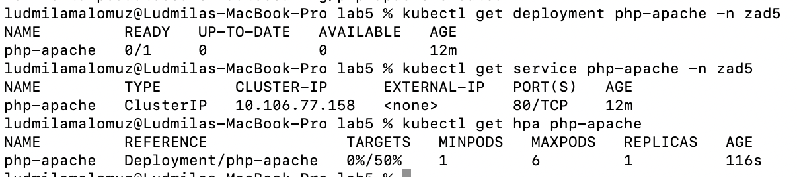
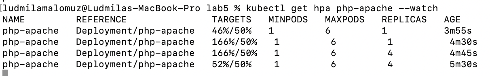

! Przed początkiem wykonania zadania trzeba uruchomić dodatek metrics-server minikube:
```
minikube addons enable metrics-server
```
1. Tworzenie przestrzeni nazw zad5 i kwoty zasobów:
```
kubectl create ns zad5
kubectl create quota quota5 -n zad5 -o yaml --hard=cpu=2,memory=1.5G,pods=10 --dry-run=client > quota5.yaml
kubectl apply -f quota5.yaml
```

2. 
```
kubectl run worker -n zad5 --image=nginx -o yaml --dry-run=client > worker.yaml
```
Do pliku konfiguracyjnego w sekksci ***resources*** dodajemy ograniczenia zasobów:
```limits:
     memory:  200Mi
     cpu:  200m
requests:
     memory:  100Mi
     cpu:  100m
```


3. Tworzymy deployment na podstawie pliku php-apache.yaml:

4. Tworzenie pliku hpa (autoscalera). Minimalna liczba replik to 1, a maksymalna 6. Uzasadnienie: bierzemy pod uwage ograniczenia pamięci kwoty - 1500Mi oraz CPU - 2000m, oraz deploymentu - 250M i 250m. Zatem górną granicą replik jest ***min((1500/250),(2000/250))***, czyli 6.
```
kubectl autoscale deployment php-apache -o yaml --min=1 --max=6 --cpu-percent=50 --dry-run=client > hpa.yaml
```
Potwierdzenie utworzenia skalowania:

5. Utworzenie obiektów i potwierzdenie ich utworzenia:
```
kubectl get deployment php-apache -n zad5
kubectl get service php-apache -n zad5
kubectl get hap php-apache
```

6. Generowanie obciązenia dla serwera:
```
kubectl run -i --tty load-generator --rm --image=busybox:1.28 --restart=Never -- /bin/sh -c "while sleep 0.01; do wget -q -O- http://php-apache; done"
```
Obserwowanie zmian skalowania (zwiekszenie liczby replik wraz ze wzrostem wykorzystanych zasobów):
```
kubectl get hpa php-apache --watch
```
